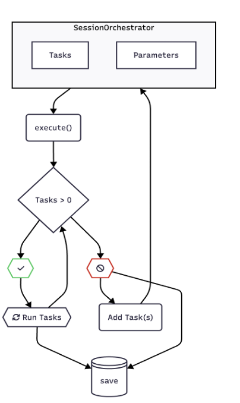

# Summary

Advances in Brain-Computer Interface (BCI) research require software that evolves alongside new scientific discoveries and experimental needs. BciPy 2.0 is a major update and expansion of the original BciPy 1.0, developed in response to recent progress in the field. This release is designed to address the increasing demands of BCI research, with a particular focus on communication BCIs (cBCIs). BciPy 2.0 offers robust support for multimodal data acquisition and fusion, advanced simulation capabilities, flexible task orchestration, and standardized data sharing—all within the Python ecosystem. The system prioritizes modularity and extensibility, incorporating features informed by current research trends. This manuscript provides a comprehensive overview of BciPy 2.0, including system architecture, validation results, and practical usage examples.

# Statement of Need

Software is the foundation of BCI research, serving as the bridge between biosignals and real-time applications that enable computer-mediated control. Reliable and adaptable tools are crucial for improving system accuracy, reducing latency, and expanding functionality—especially for communication BCI (cBCI) applications. These improvements bring cBCIs closer to practical, real-world use, with significant implications for healthcare, accessibility, and human-computer interaction.

Since its initial public release [@Memmott:2021], BciPy has gained wide adoption in the BCI community, with 134 GitHub stars, approximately 30 citations (26 via ResearchGate and Google Scholar, and four from preprints), and over 65,700 downloads. The Python BCI ecosystem has also grown, with several complementary libraries released or updated [ADD OTHER PYTHON BCI SOFTWARE HERE]. Early adoption of BciPy 2.0 is evident, with five published studies utilizing its redesigned architecture already.

Current trends in BCI research include increased interest in multimodal signal acquisition and integration, as well as the use of advanced modeling techniques to improve classification and inference. The scientific community is also prioritizing data practices that follow the FAIR principles — Findable, Accessible, Interoperable, and Reusable [@Wilkinson:2016] — which BciPy 2.0 is built to support. Additionally, some dependencies and Python versions used in BciPy 1.0 are now deprecated or incompatible with modern tools. Future releases will continue to enhance interoperability with popular scientific libraries and features, and provide expanded support for experiment management.

# BciPy Overview

BciPy is designed for ease of use and flexibility, supporting installation on the latest versions of macOS, Linux, and Windows. Step-by-step installation instructions are provided in the documentation, and reproducible builds are demonstrated via GitHub Actions workflows (`.github/workflows/main.yml`). Each submodule includes its own `README.md`, runnable demos, and unit tests to help users get started. Users can interact with BciPy through the client interface, by importing the package in Python, or via the PyQt6-based GUI (`BCInterface.py`, see Figure 1). The choice of interface depends on the user's coding experience and the level of customization required for their experiments.

Experiment parameters are defined in JSON format, with default templates available in `bcipy/parameters/`. These parameters can be edited directly in the JSON files or using the graphical parameter editor (Figure 2), allowing for easy personalization and adaptation to a wide range of research needs. Data collected with BciPy can be exported to multiple formats—including BDF, EDF, BrainVision, Brain Imaging Data Structure (BIDS), and MNE—for external analysis or sharing, supporting FAIR data principles. Compression options are available to facilitate data sharing and storage.

BciPy leverages several scientific libraries to provide its core features, including PsychoPy, PyLSL, scikit-learn, transformers, NumPy, SciPy, Pandas, and MNE [@Peirce:2007; @Kothe:2025; @Wolf:2020; @VanDerWalt:2011; @Virtanen:2020; @McKinney:2011; @Gramfort:2014]. The full list of dependencies is maintained in the `pyproject.toml` file.

## Figure 1

<!-- Add Figure1 from static/ -->

### Figure 1: BciPy GUI

The BciPy GUI can be used for editing or loading parameters, training a `SignalModel`, defining a new experiment (this provides another GUI), or running an experiment or `Task`.

## Figure 2

<!-- Add Figure2 from static/ -->

### Figure 2: BciPy Parameter Editor

The BciPy Parameter Editing GUI can be used for editing, saving, or searching a parameters file. This can help prevent input errors and facilitate defining parameters for experiment conditions upfront. If parameters are changed, a panel under Changed Parameters (shown above) will display with the parameter changed and what value it’s been updated to. This can help prevent accidental changes or debug issues with a set of parameters.

# Task / Experiment Support

BciPy manages the execution of experimental tasks using the `SessionOrchestrator` class, which ensures tasks are run in the correct order and that all data are properly persisted. Researchers can run individual tasks, such as Calibration, directly via the client, or define complete experimental protocols for reproducible studies.

Experiment protocols are specified in the `experiments.json` file as ordered sequences of Tasks. The orchestrator reads this protocol, executes each Task sequentially, and logs all relevant information. Each Task writes its own logs to a dedicated subdirectory for easy tracking and analysis.

In addition to standard Tasks, protocols can include `Actions`, which are lightweight subclasses of `Task`. Actions do not require display or data acquisition and are useful for simple steps such as prompting the researcher with a dialog or indicating experiment progress. For example, an `IntertaskAction` can be inserted to request input from the researcher before continuing to the next Task in the sequence.

## Figure 3

<!-- Add Figure3 from static/ -->

### Figure 3: Session Orchestration

The `SessionOrchestrator` executes a sequence of `Tasks` defined in an experiment protocol. Each task is initialized with the current parameters and any data needed from previous tasks. The orchestrator manages the flow of data between tasks and ensures that each task is executed in the correct order. The `SessionOrchestrator`, once initialized with parameters and optional metadata, is ready for tasks to be added using the `add_tasks()` or `add_task()` methods. These can be defined and loaded using the `experiment.json` and defined protocol or manually added to the `SessionOrchestrator`. The experiment can then be run using `execute()`. This method loops over `Tasks`, providing all parameters and a log needed for operation. The `Tasks` are then responsible for initializing any objects required for operation, such as the `DataAcquisitionClient`, `Display`, or `LanguageModel`. After each task and the entire execution loop, the data persists on disk.

# Multimodal Data Acquisition and Fusion

BciPy 2.0 introduces support for multimodal data acquisition and evidence fusion. The system can consider information from multiple devices when making typing decisions. The BciPy 1.0 data acquisition module supported TCP-based connections as well as connections through LabStreamingLayer (LSL) [@Kothe:2025]. After extensive testing, we leaned more heavily on LSL to support multimodal acquisition in BciPy 2.0. LSL is well-supported across the industry, with many devices providing compatible drivers. This decision allowed us to drastically simplify the acquisition module while increasing functionality.

The data acquisition module in BciPy has two primary responsibilities: passively recording streaming device data to disk for later processing, and querying data in real time for use in a typing task. The previous BciPy 1.0 had an extremely flexible query interface, allowing any data from the start of the session to be used for decision-making.

The approach for combining multimodal data sources is described briefly. Under the conditional independence assumption, a Bayesian probabilistic algorithm that fuses information from multiple sources of evidence is employed to achieve multimodal classification. The posterior probabilities for user intent ($\theta$) given biosignals data ($x_{1:s}$) are computed using Bayes' rule as follows:

$$
p(\theta \mid x_{1:s}) \propto p(\theta) \prod_{j=1}^{s} p(x_j \mid \theta) \tag{1}
$$

Where $s$ denotes the number of sources ($s > 1$ for multimodal) and $p(\theta)$ is the class prior.

In addition to the EEG signal model developed in BciPy 1.0, BciPy 2.0 introduces a gaze model for classification of eye gaze trajectory data that can be acquired in parallel with the EEG data stream through an eye tracker. Both the EEG and gaze models inherit the same Signal Model structure and are compatible with the scikit-learn estimators API [@Pedregosa:2011].

The provided gaze model assumes positional and temporal dependence in gaze data. It is also assumed that the gaze trajectory ($x_g$) obeys a Gaussian Process distribution, that is:

$$
p(x_g \mid \theta) \sim \mathcal{GP}(\mu_{g,\theta}, \Sigma_g) \tag{2}
$$

Where $\mu_{g,\theta}$, $\Sigma_g$ are the multidimensional means and covariances corresponding to the class labels. Details of the multimodal fusion method for EEG and gaze data are further described in the repository.

BciPy 2.0 expands upon the language modeling capabilities of BciPy 1.0 and removes the language model (LM) module from the previous Docker image, opting instead for direct function calls in Python. The goal of the language model remains the same as the prior version—to accelerate the text input task by providing additional evidence to the system. The LM module takes the context, or the text that the user has written so far, and produces an initial likelihood distribution over the system's symbol set. This distribution can be used to present more likely characters to the user sooner, in a paradigm like RSVP Keyboard [@Orhan:2012], or simply to fuse with the evidence gathered from the user (e.g., EEG, gaze, etc.).

The underlying models that drive the predictions are also modular. BciPy 2.0 comes with several built-in examples, but LM model classes can easily be created or modified to better suit users' needs. For example, BciPy 2.0 introduces inference by large language models (LLMs) via the TextSlinger API, which allows the use of causal transformer models from Hugging Face using the search algorithm from @Gaines:2025. BciPy 2.0 has wrapper classes that handle the initialization of TextSlinger models for seamless use by the rest of BciPy. In addition to the causal LLM, BciPy 2.0 supports TextSlinger's n-gram language model class, which leverages the KenLM package [@Heafield:2011]. BciPy 2.0 contains a Uniform Language Model class, which returns an equal probability distribution among all characters in the symbol set, for instances where researchers may want to remove the language model influence either as a control or as an independent variable in a research study. This class also serves as an example of the methods that are required to create custom language model classes.

# BciPy Simulator

A major advancement in BciPy 2.0 is the introduction of the simulator module, which allows researchers to use previously recorded typing data to systematically evaluate how changes in parameters, signal models, and language models impact typing performance. This module supports tasks such as customizing experiment parameters, conducting large-scale comparisons of language model implementations, and testing multimodal evidence fusion strategies. Additionally, the simulator framework can be extended to train new EEG signal models.

As illustrated in Figure 4, the simulator architecture consists of several key components: the simulation Task (e.g., Copy Phrase), a `Task Runner` for managing multiple iterations, a `Data Engine` for loading and querying data samples, a `Data Processor` for formatting data for classification, and a Sampler that selects samples from the `Data Engine` using user-defined strategies. Metrics are collected for each run and summarized across all runs to assess performance. The simulator provides both a graphical user interface for designing simulation parameters and input sources, as well as a command line interface for scripting and automation.

## Figure 4

<!-- Add Figure4 from static/ -->

### Figure 4: BciPy Simulator Architecture

The BciPy Simulator consists of several components that work together to simulate a typing task using previously recorded data. The `Simulation Task` defines the task to be performed, such as Copy Phrase. The `Task Runner` manages the execution of multiple iterations of the task, collecting metrics for each run. The `Data Engine` loads and queries data samples from the provided dataset, while the `Data Processor` prepares the data to match the input format required by the classification model. The `Sampler` draws samples from the `Data Engine` based on a user-selected sampling strategy, such as random sampling or sequential sampling. The `Signal Model` and `Language Model` are used to classify the sampled data and provide predictions, respectively. Finally, the collected metrics are summarized across all runs to evaluate performance.

# References

See `paper.bib` for references.

# Acknowledgements

We’d like to thank those who helped throughout the refactor, including Aida Fakhry, Ian Jackson, Julia Gangemi, Tales Imbiriba, Emma Sombers, Georgios Stratis, David Smith, and Shijia Liu. In addition, we thank Steven Bedricks for his architectural and general advice on this significant update. This work was supported by NIH R01DC009834. Authors report no conflicts of interest.
